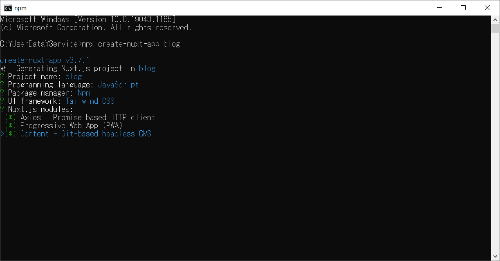
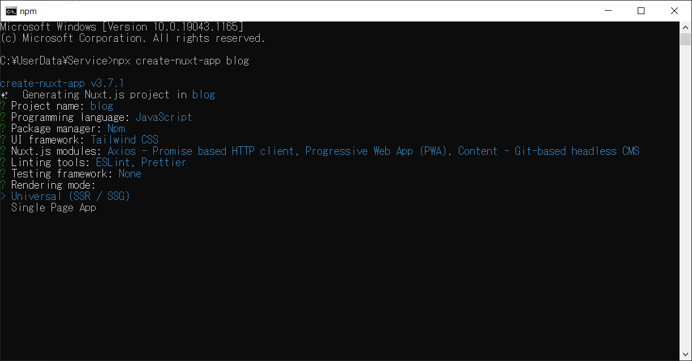
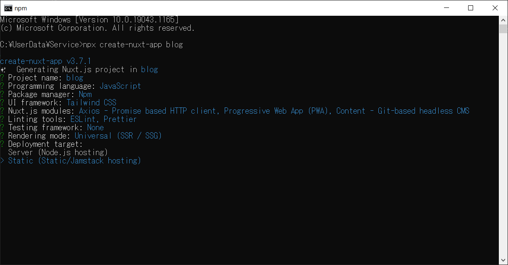
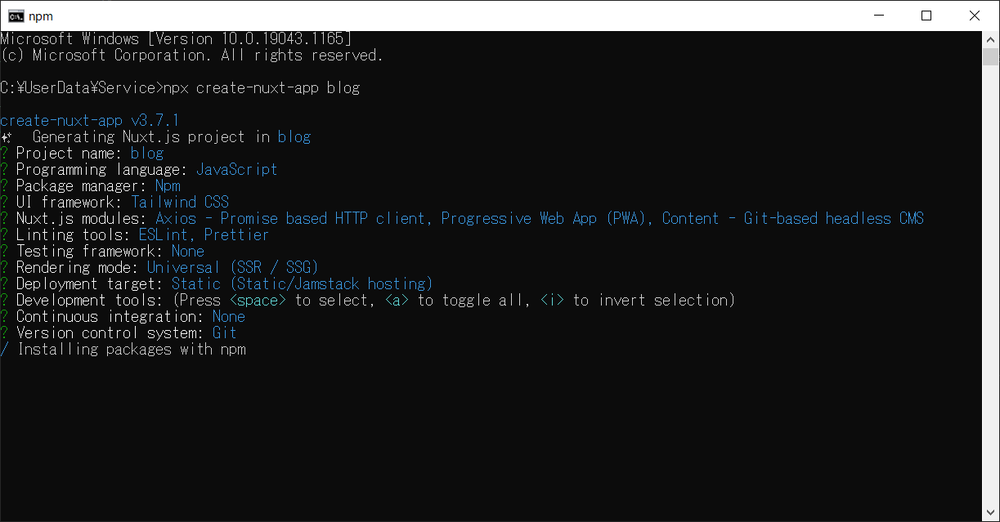

こんにちは、日々の積み上げのアウトプットとしてブログサイトを立ち上げることにしました。ブログを始めるには、様々なブログサービスを利用する、WordPressを利用してブログサイトを作成するなどの選択霜ありますが、自身のスキルアップをかねて、「できるだけ開発する」ことにしました。どのような技術を利用して開発するかいろいろな選択肢がありますが、最近個人的にはVue.jsを利用することが多いので、Nuxt.jsを利用して作成していきます。

## この記事の内容
この記事は、Next.jsのSSGを利用して技術ブログを静的サイトとして作成する方法の解説です。できるだけを早くコストを掛けずに始めるため、サーバーはAzure Static Web Appsにホストして公開しました。

>作成の手順はWindowsを利用したものです。

## 前提条件
開発には、以下の環境を利用しています。

- VSCode
- Node.js

## サイトの要件
今回の要件は一般的なブログサイトにある機能を実装していきます。要件は以下として作成を進めます。

- 管理者は、記事をMarkdownで作成し表示できる
- 記事は新着・タグ・人気別の一覧を表示できる
- 記事の全文検索ができる
- 読者は記事へコメントを投稿したり、いいねを押すことができる
- コメントはサイト管理者が確認後公開される
- 問い合わせページ、プライバシーポリシー等必要なページを作成する
- Google Analyticsを利用してサイトやコンテンツの分析ができるようにする

## プロジェクトを作成する
最初にNuxtプロジェクトを作成します。

1. コマンドプロンプトからプロジェクトを作成するフォルダーに移動し、以下のコマンドを実行します。

>npx create-nuxt-app <project-name>

今回npxを利用しプロジェクトを作成しました。この記事では説明していませんので、より詳しい内容については、公式ページを参照してください。
[Nuxt.js](https://ja.nuxtjs.org/docs/2.x/get-started/installation)

コマンドを実行すると、作成するプロジェクトの情報の入力できます。今回のプロジェクトのポイントは、「SSG」と「Jamstack」を選択することです。また、Contentを利用しますので、Nuxt.js modulesでContentを選択しておきます。



- Rendering mode Universal (SSR / SSG)



- Deployment target Static (Static/Jamstack hosting)


今回作成したプロジェクトの完全な情報は以下となります。



### プロジェクトの構成
```
✨  Generating Nuxt.js project in blog
? Project name: blog
? Programming language: JavaScript
? Package manager: Npm
? UI framework: Tailwind CSS
? Nuxt.js modules: Axios - Promise based HTTP client, Progressive Web App (PWA), Content - Git-based headless CMS
? Linting tools: ESLint, Prettier
? Testing framework: None
? Rendering mode: Universal (SSR / SSG)
? Deployment target: Static (Static/Jamstack hosting)
? Development tools: (Press <space> to select, <a> to toggle all, <i> to invert selection)
? Continuous integration: None
? Version control system: Git

```

## nuxt/contentとは
利用するモジュールはnuxtのcontentを利用し、MarkDownファイルをビルド時にAPIで取得し、静的サイトを生成します

nuxt/contentの公式ページは以下となります。

[nuxt/content](https://content.nuxtjs.org/ja)

## tailwindcss/typography
tailwindcss/typographyをインストールします。typographyはMarkdownからレンダリングされたHTMLに、デフォルトのスタイルを追加してくれるプラグインです。

1. npmからtypographyをインストールします。
  >npm i @tailwindcss/typography

1. tailwindcssのConfigファイルを作成します。
  >npx tailwindcss init

1. tailwindcssのConfigにtypographyを追加します。
  ```js
    plugins: [
      require('@tailwindcss/typography'),
    ],
  ```
## 最初のコンテンツを作成
プロジェクトを作成するとルートにcontentフォルダーが作成されています。ここにMarkdown、JSON、YAML、XML、CSVファイルを入れることで、APIを使ってデータを取得するヘッドレスCMSを実現しています。

WordPressのMongoDBに格納する情報をこのフォルダ―に配置することCMSを実現するイメージです。（あくまでもイメージです）

1. contentフォルダーにマークダウンファイルを配置します。

    「content/hello.md」に初期ファイルが作成していますが、articlesフォルダ―を作成し、その中にMarkdownファイルを配置します

    ```
    content
    |-articles
    |--articles1.md
    |--articles2.md
    ```

2. 記事の作成

    Markdownファイルには、titleなどSEOのためのmeta情報を含めることができます。

    >articles1.md
    ```
    ---
    title: 最初のブログ
    description: これは最小のブログです。
    ---
     
    最初のブログ

    ```
## コンテンツの一覧を作成する
まずはデフォルトのトップページから、作成するブログ一覧へのリンクを作成します。pagesフォルダー直下のindex.vueを以下のように変更します。
```vue
<template>
  <!-- <Tutorial/> -->
  <NuxtLink to="/articles">ブログの一覧</NuxtLink>
</template>

<script>
export default {}
</script>
```

次にpages\articlesフォルダー内にindex.vueファイルを作成します。

```vue
<template>
  <section class="blog">
    <ul class="articles">
      <li v-for="article of articles" :key="article.slug" class="article">
        <nuxt-link
          :to="{
            name: 'articles-slug',
            params: { slug: article.slug, dir: article.dir },
          }"
        >
          <h2>{{ article.title }}</h2>
          <p>{{ article.description }}</p>
        </nuxt-link>
      </li>
    </ul>
  </section>
</template>

<script>
export default {
  async asyncData({ $content }) {
    const articles = await $content('articles', { deep: true })
      .only(['title', 'slug', 'updatedAt', 'description', 'dir'])
      .sortBy('createdAt', 'asc')
      .fetch()
    return { articles }
  },
}
</script>
```

ブログの詳細を表示するページへのリンクを作成します

```html
        <nuxt-link
          :to="{
            name: 'articles-slug',
            params: { slug: article.slug, dir: article.dir },
          }"
        >
```

ブログの一覧は$contentのfetch()メソッドで取得できます。「 { deep: true }」オプションを取得することで、サブフォルダーを含むMarkdownファイルの一覧を取得することができます。

>$content(path, options?)

```js
const articles = await $content('articles', { deep: true }).fetch()
//ika
    const articles = await $content('', { deep: true })

```

## コンテンツの表示
MarkDownファイルを表示するページを作成します。

1. pagesフォルダーのarticlesフォルダーを作成します
1. _slug.vue

``vue
<template>
  <article class="article prose lg:prose-xl">
    <h1>{{ article.title }}</h1>
    <p>{{ formatDate(article.updatedAt) }}</p>
    <nuxt-content :document="article" />
  </article>
</template>

<script>
export default {
  async asyncData({ $content, params }) {
    const article = await $content(params.dir, params.slug).fetch()

    return { article }
  },
  methods: {
    // format the date to be displayed in a readable format
    formatDate(date) {
      return new Date(date).toLocaleDateString('ja', {
        year: 'numeric',
        month: 'long',
        day: 'numeric',
      })
    },
  },
}
</script>```

このままだとスタイルが適用されない状態となりますので、articleにtailwindcss/typographyを追加します。
```js
  <article class="article prose lg:prose-xl">
``` 

左に表示されるので、ページ中央に移動するスタイルを追加します。

```js

<style scoped>
@layer components {
  .article {
      @apply prose lg:prose-xl;
      @apply p-4 mt-6 lg:mt-8 m-auto lg:max-w-5xl;
  }

  .article-header{
      @apply mb-12 pb-8 lg:mb-16 border-gray-200 border-b-2;
  }

  .article-header h1{
      @apply mb-0;
  }

  .article-header .details-cont span{
      @apply text-opacity-50 text-sm;
  }
}
</style>
```

取得したコンテンツは、meta情報にもアクセスできます。Markdownの本文をHTMｌに展開して表示するためのコンポーネント（nuxt-content）を利用することで本文の表示が可能です。

```html
<h1>{{ content.title }}</h1>
```

## 不要なファイルの削除
削除するファイル
components
  NuxtLogo.vue
  Tutorial.vue
置き換えるファイル
static
  favicon.ico
  icon.png


## レイアウトファイルを作成する
layoutsフォルダーにdefault.vueを作成します。
ヘッダー、フッター等、すべてのページで共通する物はここに配置指定おきます。

特定のページのみ別のレイアウトを使用したい場合はlayoutsフォルダーにblog.vue等のレイアウトファイルを作成し
使用するページでレイアウトを指定します
<script>
export default {
  layout: 'blog',
  // または
  layout (context) {
    return 'blog'
  }
}
</script>

まずはヘッダー、フッターのコンポーネントを作成します

共通のレイアウトへヘッダーふっだー


faviconをicoではなくPNGに置き換える場合はnuxt.config.jsを変更します
```js
  head: {
    title: 'blog',
    meta: [
      { charset: 'utf-8' },
      { name: 'viewport', content: 'width=device-width, initial-scale=1' },
      { hid: 'description', name: 'description', content: '' },
      { name: 'format-detection', content: 'telephone=no' }
    ],
    link: [
      { rel: 'icon', type: 'image/x-icon', href: '/favicon.png' }
    ]
  },
```


## 動的ルーティング

ページを表示するためには、/Pagesに上記のコンテンツを取得するAPIを組み込んだページを作成する必要があります。これを実現するために

「content/articles/articles1.md」を表示するために「http://localhost:3000/articles/articles1」でアクセスできると良いのですが、自動では作成されません。

対応する個々のページを作るのでは、効率が悪いので、以下の動作をづるページを作成します

1. articles/articles1のURLばあい、articles1をパラメータとするページを作成
1. articles1のコンテンツをAPIで取得
1. articles1の本文を表示

```
pages/
|-article/
|--_slug.vue
|--index.vue

```
- _slug.vue：パラメータで指定されたコンテンツの内容を表示するページ

_slug のようにアンダースコアではじまるファイル名は動的ルーティングのスラッグを格納する変数名となり、 params.slug のように参照する事ができます。

```vue
<template>
 <article>
   <h1>{{blogs.title}}</h1>
   <p>{{blogs.date}}</p>
   <nuxt-content :document="blogs" />
 </article>
</template>
<script>
export default {
 async asyncData ({ $content, params }) {
   const blogs = await $content('articles', params.slug || 'index').fetch()
   return { blogs }
 }
}
</script>
```

- index.vue：コンテンツの一覧ページ

ここでは上位１０件の一覧を表示しています。Sort、絞り込みなども実現可能です。

```vue
<template>
 <div>
   <div v-for="b in blogs" :key="b.slug">
     <nuxt-link :to="'/articles/'+ b.slug">{{b.title}} {{b.date}}</nuxt-link>
   </div>
 </div>
</template>
<script>
export default {
 async asyncData ({ $content, params }) {
   const query = await $content('articles' || 'index').limit(10)
   const blogs = await query.fetch()
   return { blogs }
 }
}
</script>
```
## generate

デフォルトのままgenerateだけでは、静的ファイルは生成されません。nuxt.config.js に generate の設定を行います。

```js
  generate: {
    async routes() {
      const { $content } = require('@nuxt/content')
      const files = await $content({ deep: true }).only(['path']).fetch()
      return files.map((file) => (file.path === '/index' ? '/' : file.path))
    },
  },
```

のデプロイする方法です。利用するモジュールはnuxtのcontentを利用し、MarkDownファイルをビルド時にAPIで取得し、静的サイトを生成します。

静的サイトとなるのでコンテンツの追加、変更はビルド、デプロイとなりますので、ホームページやブログなどの用途に向いています。

1. コンテンツの作成⇒ビルド⇒デプロイ
1. コンテンツの変更・追加⇒ビルド⇒デプロイ

>npm run generate

generateを実行すると、/distフォルダ―にコンテンツ毎のフォルダーが作成され、各ContentsのIndexファイルを作成されています。これをvercelなどにデプロイすることで完成です。


>npm run start 

でdistを表示指せることができます。

## デプロイ
主なデプロイ先

Firebase hosting
AZURE Static Web App
vercel
Netlify
GitHub Action


## 参考資料
https://miracleio.me/blog/creating-a-blog-using-nuxt-and-nuxt-content---with-tailwindcss#install-tailwind-and-tailwindcss-typography-via-npm

https://nuxtjs.org/blog/creating-blog-with-nuxt-content
https://templates.netlify.com/template/awake-blog-template-nuxt/
https://jamstackthemes.dev/ssg/nuxt/
https://www.suzu6.net/posts/265-nuxt-content-remark/
[Nuxt Contentで静的サイトの初期設定をする話](https://note.matsukaze.design/article/2021/0130-nuxt-content)